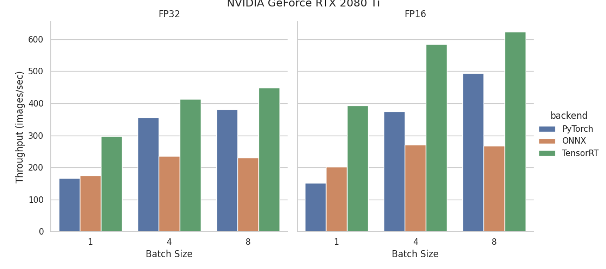
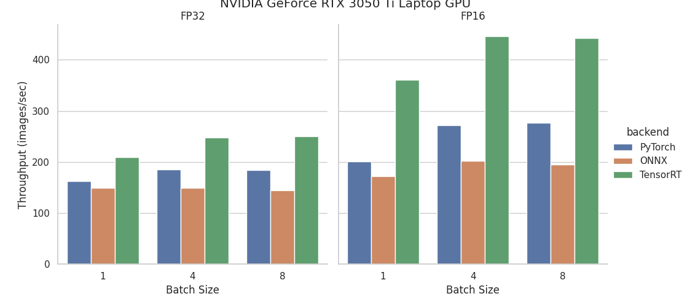
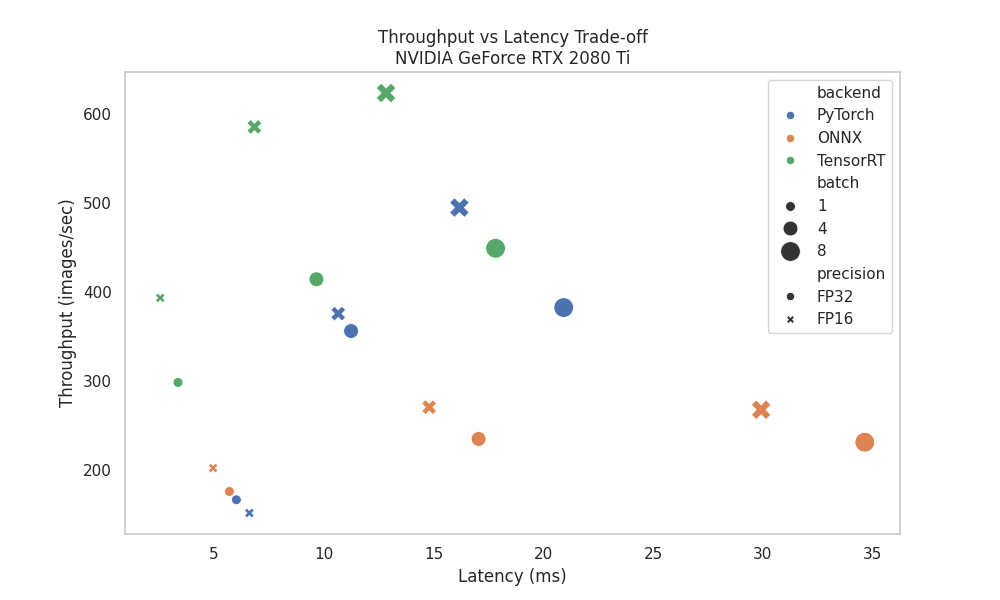
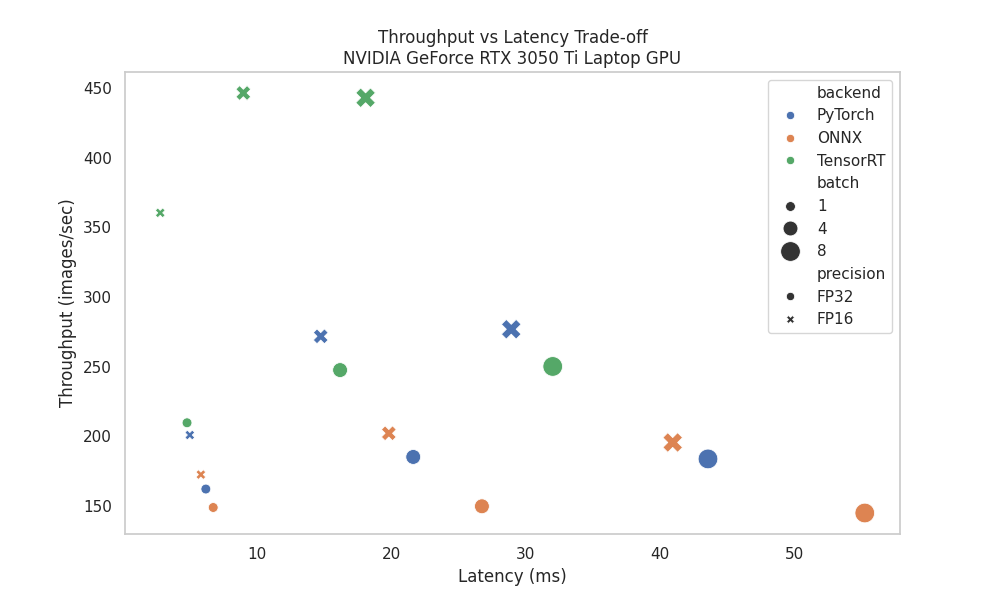

# YOLO Hardware Benchmark

A small playground for testing how different optimisation techniques affect YOLO inference performance across hardware.

## Overview

This repository benchmarks YOLO inference performance across multiple deployment backends and optimisation strategies on NVIDIA GPUs.

It provides comparisons across:

| Backend  | Description                                   |
| -------- | --------------------------------------------- |
| PyTorch  | Baseline inference without graph optimisation |
| ONNX     | Graph optimisation via ONNX Runtime           |
| TensorRT | Hardware-specific optimisation and execution  |


The benchmark focuses on three key metrics:

- **Latency (ms)** - time per inference step
- **Throughput (images/sec)** - total images processed per second
- **VRAM usage (MB)** - GPU memory consumption

The goal is not maximum theoretical performance, but practical, reproducible insights into deployment trade-offs.

### Optimisation techniques explored

* FP32 vs FP16 precision
* ONNX export and runtime execution
* TensorRT engine generation
* Batch size scaling


---

## Repository structure

```bash
.
├── models/                # Input and exported models
├── scripts/
│   ├── export.py         # Exports ONNX and TensorRT engines
│   ├── benchmark.py      # Runs performance benchmarks
│   └── plot.py           # Generates visualisations
├── results/
│   ├── benchmarks/       # Raw CSV outputs
│   └── plots/            # Generated plots
└── README.md
```

---

## Model formats explained

This project compares three common model formats used during deployment:

### `.pt` (PyTorch)

The native PyTorch format used during training and development.

* Easy to use and flexible
* No graph-level optimisation
* Runs through the PyTorch runtime

Best for: experimentation and development


### `ONNX`

An intermediate representation designed for portability across frameworks.

* Static computation graph (optimised vs PyTorch eager execution)
* Can run on different runtimes (CPU, GPU, TensorRT, etc.)
* Enables graph-level optimisations

Best for: portability and moderate performance gains


### `TensorRT engine` (`.engine`)

A hardware-optimised format built specifically for NVIDIA GPUs.

* Performs layer fusion, kernel tuning, and memory optimisation
* Compiled for a specific GPU and configuration (batch, precision)
* Fastest inference, but least flexible

Best for: production inference on NVIDIA GPUs

---

## Requirements

This project is designed to run on NVIDIA GPUs with CUDA support.

### System requirements

* Python **3.12**
* NVIDIA GPU
* CUDA
 
  * PyTorch
  * ONNX Runtime
  * TensorRT versions


### Verify CUDA

You can quickly check that CUDA is available:

```bash
python -c "import torch; print(torch.cuda.is_available())"
```

This should return:

```bash"
True
```

If it returns `False`, your CUDA setup is not correctly configured.


### Notes

* GPU acceleration is required for meaningful benchmarking results.
* ONNX Runtime and TensorRT will fall back to CPU if CUDA is not available, which will significantly impact performance.
* The scripts have been tested on:

  * Desktop GPUs (e.g. RTX 2080 Ti)
  * Laptop GPUs (e.g. RTX 3050 Ti)

---

## Setup

```bash
git clone https://github.com/felipmarti/yolo-hardware-benchmark.git
cd yolo-hardware-benchmark

python -m venv .venv
source .venv/bin/activate

pip install -r requirements.txt
```

---

## Prepare model

Place a YOLO model inside the `models/` directory. E.g.,:

```bash
models/yolo11n.pt
```

---

## Export models

Export ONNX and TensorRT engines for multiple batch sizes:

```bash
python scripts/export.py --model yolo11n.pt --imgsz 640
```

This generates one model per batch size and precision:

```
models/
  yolo11n_b1_fp32.onnx
  yolo11n_b1_fp16.onnx
  yolo11n_b1_fp32.engine
  yolo11n_b1_fp16.engine

  yolo11n_b4_fp32.onnx
  yolo11n_b4_fp16.onnx
  yolo11n_b4_fp32.engine
  yolo11n_b4_fp16.engine

  yolo11n_b8_fp32.onnx
  yolo11n_b8_fp16.onnx
  yolo11n_b8_fp32.engine
  yolo11n_b8_fp16.engine
```

Each file corresponds to:

* A fixed batch size (`b1`, `b4`, `b8`)
* A precision (`fp32`, `fp16`)
* A backend format (`onnx`, `engine`)

---

## Run benchmark

```bash
python scripts/benchmark.py --model yolo11n --imgsz 640
```

Example output:

```
PT FP32: 6.32 ms | 158 FPS
ONNX FP16 (GPU): 5.86 ms | 170 FPS
TRT FP16: 2.84 ms | 352 FPS
```

Results are saved to:

```
results/benchmark_<GPU_NAME>.csv
```


---

## Benchmark methodology

To ensure consistent comparisons:

- GPU execution with CUDA
- Warmup iterations before measurement
- CUDA synchronisation for accurate timing
- Fixed input size (default: 640×640)
- Static batch sizes per configuration

Test parameters

- Batch sizes: 1, 4, 8
- Precision: FP32, FP16
- Backends: PyTorch, ONNX Runtime, TensorRT

Notes

- Throughput is measured in **images per second**, not batches per second
- TensorRT requires separate engines per batch size and precision


---

## What is measured

Each configuration is evaluated using:

* Latency (milliseconds)
* Throughput (images per second)
* GPU memory usage (VRAM)

### Test dimensions

* Batch sizes: 1, 4, 8
* Precision:

  * FP32
  * FP16

---

## Results

###  RTX 3050 Ti (Laptop)

| Batch | Backend  | Precision | Latency (ms) | FPS        | VRAM (MB) |
| ----- | -------- | --------- | ------------ | ---------- | --------- |
| 1     | PyTorch  | FP32      | 6.17         | 162.07     | 42.10     |
| 1     | PyTorch  | FP16      | 4.98         | 200.85     | 46.94     |
| 1     | ONNX     | FP32      | 6.72         | 148.82     | 46.94     |
| 1     | ONNX     | FP16      | 5.80         | 172.44     | 46.94     |
| 1     | TensorRT | FP32      | 4.77         | 209.63     | 51.39     |
| 1     | TensorRT | FP16      | **2.78**     | **360.33** | 51.39     |
| 4     | PyTorch  | FP32      | 21.61        | 185.11     | 42.10     |
| 4     | PyTorch  | FP16      | 14.72        | 271.69     | 46.94     |
| 4     | ONNX     | FP32      | 26.72        | 149.69     | 46.94     |
| 4     | ONNX     | FP16      | 19.79        | 202.10     | 46.94     |
| 4     | TensorRT | FP32      | 16.16        | 247.46     | 76.47     |
| 4     | TensorRT | FP16      | **8.96**     | **446.35** | 76.47     |
| 8     | PyTorch  | FP32      | 43.55        | 183.69     | 56.24     |
| 8     | PyTorch  | FP16      | 28.90        | 276.77     | 61.08     |
| 8     | ONNX     | FP32      | 55.22        | 144.87     | 61.08     |
| 8     | ONNX     | FP16      | 40.92        | 195.48     | 61.08     |
| 8     | TensorRT | FP32      | 31.99        | 250.06     | 120.51    |
| 8     | TensorRT | FP16      | **18.06**    | **442.92** | 120.51    |


###  RTX 2080 Ti (Desktop)


| Batch | Backend  | Precision | Latency (ms) | FPS        | VRAM (MB) |
| ----- | -------- | --------- | ------------ | ---------- | --------- |
| 1     | PyTorch  | FP32      | 6.02         | 166.25     | 42.10     |
| 1     | PyTorch  | FP16      | 6.61         | 151.36     | 46.94     |
| 1     | ONNX     | FP32      | 5.70         | 175.56     | 46.94     |
| 1     | ONNX     | FP16      | 4.95         | 201.84     | 46.94     |
| 1     | TensorRT | FP32      | 3.35         | 298.09     | 51.39     |
| 1     | TensorRT | FP16      | **2.54**     | **393.03** | 51.39     |
| 4     | PyTorch  | FP32      | 11.24        | 355.84     | 42.10     |
| 4     | PyTorch  | FP16      | 10.66        | 375.38     | 46.94     |
| 4     | ONNX     | FP32      | 17.05        | 234.57     | 46.94     |
| 4     | ONNX     | FP16      | 14.80        | 270.26     | 46.94     |
| 4     | TensorRT | FP32      | 9.66         | 413.96     | 76.47     |
| 4     | TensorRT | FP16      | **6.84**     | **585.18** | 76.47     |
| 8     | PyTorch  | FP32      | 20.93        | 382.20     | 56.24     |
| 8     | PyTorch  | FP16      | 16.18        | 494.54     | 61.08     |
| 8     | ONNX     | FP32      | 34.65        | 230.88     | 61.08     |
| 8     | ONNX     | FP16      | 29.93        | 267.32     | 61.08     |
| 8     | TensorRT | FP32      | 17.83        | 448.78     | 120.51    |
| 8     | TensorRT | FP16      | **12.84**    | **623.26** | 120.51    |
---

## Results visualisation

### Throughput comparison (FPS)

The bar plot shows how throughput (FPS) changes across backends, batch sizes, and precision.





**What this shows:**

* TensorRT consistently delivers the highest throughput
* FP16 improves performance in most cases, especially on TensorRT
* Larger batch sizes increase throughput by better utilising the GPU

---

### Throughput vs latency trade-off

These scatter plots show the relationship between latency and throughput.






**Key observations:**

For both GPUs, TensorRT configurations occupy the upper region of the plots, reaching the highest throughput values at comparable or lower latency than other backends. FP16 points are consistently positioned above their FP32 counterparts within the same backend and batch size, indicating higher throughput at similar or lower latency. Increasing batch size shifts points to the right (higher latency) and generally upward (higher throughput). However, for some configurations, the increase in throughput from batch size 4 to batch size 8 is smaller than the increase observed from batch size 1 to batch size 4. The overall distribution of points follows a similar pattern across both GPUs, with the RTX 2080 Ti showing higher absolute throughput values than the RTX 3050 Ti Laptop GPU across comparable configurations.

---

## Understanding batch size and throughput

Batch size impacts performance in two ways:

- Larger batches increase total latency per inference step
- Larger batches improve GPU utilisation and throughput

Trade-off

- Batch = 1 → lowest latency (real-time applications)
- Batch > 1 → higher throughput (offline processing)


Throughput is measured as images per second, not batches per second.

This means:

A higher batch size processes more images per inference step. Even if latency increases, total throughput can still improve

The key trade-off:

- Optimise for latency → use small batches
- Optimise for throughput → use larger batches

---

## Learnings

* TensorRT is the fastest backend due to hardware-specific optimisation (kernel fusion, memory planning, GPU tuning)
* ONNX sits in the middle -  better than PyTorch, but not as optimised as TensorRT
* PyTorch is the most flexible but the slowest for inference

* FP32 (32-bit floating point) provides higher numerical precision  
* FP16 (16-bit floating point) reduces precision but is faster and uses less memory bandwidth  


* FP16 is not always faster in PyTorch due to overheads, but shines in TensorRT

* Increasing batch size:
  * Increases total latency (more images to process)
  * Improves GPU utilisation
  * Does not always improve per-image latency

* Best overall performance:

 TensorRT + FP16 + small batch size (for low latency)

 TensorRT + FP16 + larger batch (for throughput workloads)

---

